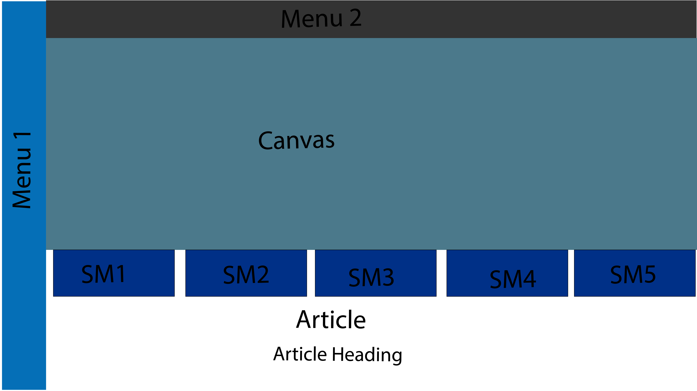

# Ain't gonna lie chat (8/5/25)

## This one got me a little bit

I was working on recreating this [website page](https://www.noaa.gov/climate) from the NOAA website. I created an outline in Adobe Illustrator real quick of the page, and I added screenshots to the file for reference. I'm not going to include the full .psd file because it'll be huge and I don't know if who has Photoshop or Illustrator. But, here's an exported image from it anyways.

I spent way too long on this and I'm a little unsatisfied with it. I felt like I got a crash course on CSS mostly.

I also forgot to use table tag, so I definitely was doing this the hard way...

Anyways, I figured it out as best as I can, so whatever lol.

###### Honestly, [this is me right now](https://youtu.be/AtPrjYp75uA?si=QG63nMeRuukKDCDw)

I'm tired. I have band practice tonight and I'm hungry. I'm going home.

[byeeee](https://youtu.be/1PlCLwlKAdI?si=WzbBAlWxsMyvM_0o&t=9)

## Update
I got so locked in, I didn't even realize that wasn't even the assignment I was supposed to submit. So I literally went way out in the weeds lmaooo. The homework was so easy bro hahaha.

It's all good tho. I ate my sandwich and slammed a Red Bull. 

[We're so back.](https://www.youtube.com/watch?v=lPk_zyRKs1Q)