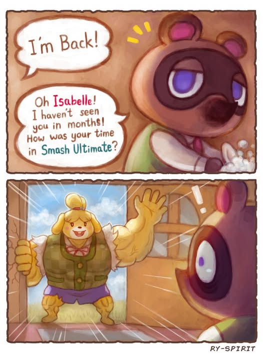

# Aug 11th, 2025

## CSS: Playing with My Design Obsession

I have this issue where I get really involved with making my stuff look nice. I don't know if it's my military background seeking order and discipline or if it's the hotgirl in me playing Animal Crossing and Stardew Valley.

###### if you play the Sims, you're too far gone...

As always, I worked ahead. I'm a busy person, so I want to pad as much time as I can with the rest of my life. Just today, I'm meeting with a friend after school, have band practice at 6pm, and I have a lot of bookings to get back to for my business. I also have this show I desperately need people to come to because I owe this band $1500 and I'm freaking out I won't hit the $1500 mark...

Anyways, CSS, is pretty cool. This is the first time I've actually been using a stylesheet file instead of just baking it directly into the HTML itself. But I've been messing around with alignment, colors, and text for a minute. It's pretty fun. I find myself spending the most time stuck on this. It's kind of the bane of my existence, but I love the pain and misery that comes with my frustration.

In the end, forcing myself to use these tools are good because the more I do it, the better I'll get. I want to get decent pretty quickly, and I want to be able to start using my skills as soon as possible.

[Until next time...](https://www.youtube.com/watch?v=z2AyJTOR_qw)