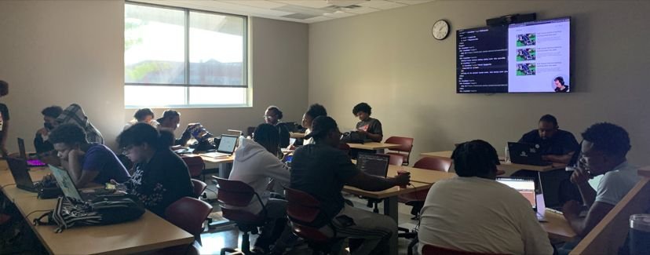

Scene:

Lights are low to prevent screen glares and eye strain

Keyboards are clacking

Video game music, Lofi, Hiphop, and synthwave are always on rotation through the room's speakers

The bigscreen TVs are playing coding videos for additional motivation through the work day

The aroma of cocoa butter permeates every corner

Fros and locs as far as the eye can see

Local businesses are getting their first websites built

Engineers are configuring and deploying Node or dotnet APIs

Instructional staff are on call to pair program with Engineers at the Help Desk

PMs are keeping their projects on track

Engineers are writing beautiful UIs in React or Razor

We collectively weep when a new bug appears

We have a round of applause whenever a new feature is complete or a bug is fixed

Interviews are scheduled; start dates are coming up

We enjoy our work, not just our breaks

----------------------------------------------

This is Beale St
This is Memphis
This is CodeCrew CodeSchool

#CodeCrewCodeSchool #CodingBootcamp #GritGrindCode #SoftwareDevelopment #TheSouthGotSomethingToSay #OpenForWork