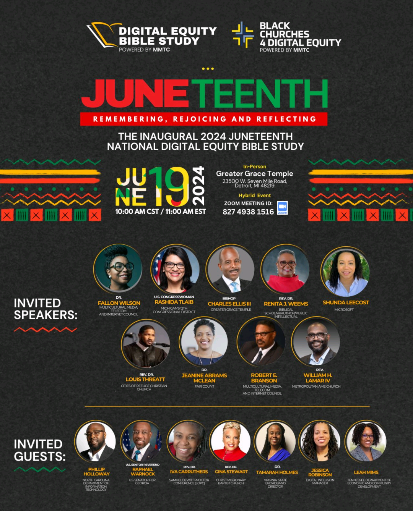

[Juneteenth Digital Equity Bible Study](https://www.digitalequitybiblestudy.com/)

## Hello World

This program was a great addition to my morning on this year's Juneteenth Holiday. 
It was a wonderful mix of Black Church and Black Scholarly traditions that raised and molded me. 

The various speakers utilized Call and Response, continually emphasized FREEDOM, told stories of our collective pursuit of excellence, spoke of stories and their experiences to make sure we'd remember the those who came before and the lessons they instilled by them through their words of wisdom and the example of their perserverance. 

All of that filled me with a supercharged motivation to master the world around me and to empower others to do the same.

## Juneteenth and the Transmission of Information

Juneteenth's not the day that American chattel slavery was ended, but the approximate delivery date of that information to everyone effected by it.

This is an important thing to note, because societies, as a whole, will stagnate when their is a lack of information transmission from one party to the next. 
People, in general, won't do well in low information settings either. When there are no communicated feedback or proper updates in response to work done, frustrations build. 

Each person should have their due rights, able to participate and engage in the world at will.
Restricting them from being able to interact with the world in an equitable manner is unjust. The focus of the Digital Equity movement is to push for justice in this regard.

Digital Equity resonates with me as my personal focus is the empowerment of these same folks, who just need access and understanding to tap into all the information and technological tools all around them. 

Before the Internet, phone lines carried info faster and further than anything seen before in history. 
Before that, vehicles like boats, trains, and planes increased the speed that information could travel from one place to the next. 
And even before that, humans had to rely on horses for far and widespread information dispersal. 

We're blessed to live in a world that has gotten us to a point that we have lightning fast 
networks of communication. We still don't utilize them to their fullest potential, because 
all of us still aren't able to get to, let alone DRIVE as active participants on the information highways.

Beyond using internet enabled computers, we need to get better at training new generations of developers and maintainers of this infrastructure. Basic Reading, wRiting, and aRithmatic will take us SO far and then just applying those skills into the (THANKFULLY) free tech documentation and resources will enable the future that our ancestors have dreamed of.

## Why I Educate

I could go on and on, but hopefully this reflection illustrates at least a portion of the vision that we have and points others to the future.

Information (Technology) has always has been a pivotal tool for humanity. 

It's how we communicate, how we coordinate, and even how we liberate.

That's why we celebrate.

After taking this day to commemorate, let's continue to collaborate and build a world for us all to cohabitate.

Don't stop. Innovate.