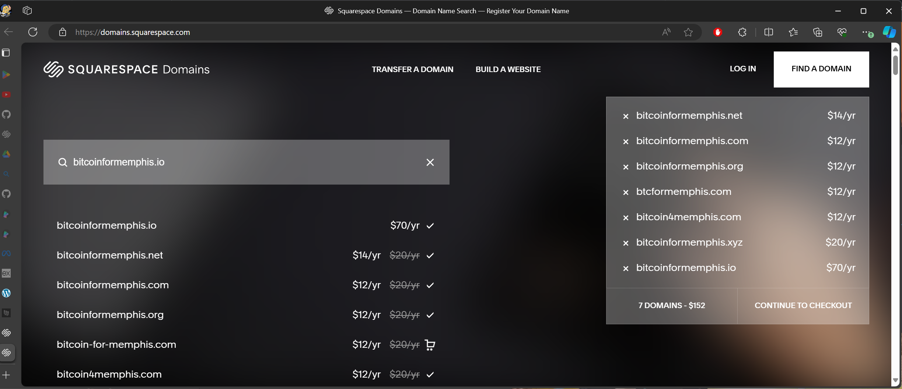

# Index

## Tech News and Thoughts

## Table of Contents

[How New Tech Takes Your Job](./FORTRAN.md)

[Juneteenth and the Liberating Power of Information](./Juneteenth24.md)

<!-- 
[CSU - Computer Science Universe](./CSU.md)
How the world can benefit from a more integrated and base understanding of logic/computational thinking
 Building a Computer Science Universe-ity @ CodeCrew -- Render, BITCON, BTC?
    Teaching CS
        What is CS
        Relating CS to IRL
        How to Study CS
        Applied CS - Software Engineering
    Curriculum Development
        Communication
        Resources
        Culture
    Open Source
        Dev Tools
        C-Suite Apps
        Bitcoin
    Growing a Business/Team
        Leadership & Collaboration
        Forward Thinking

[Bitcoin](./Bitcoin.md) 
 Bitcoin = Computer Science + Economics + Philosophy
  NOT about profit in USD. 
  New Economic System to engage in
  Pitfalls of Fiat / USD Banking System
  Fixes available in BTC
  How to Engage
  Study Bitcoin

[Bitcoin For Memphis](./BitcoinMemphis.md)

Bitcoin in the Memphis Treasury
Public Wallet for Donations
High performing asset since 2009
Public Plan for funds - programs, roads, schools, future improvements, reno projects, future minded
    - blueprint for public departments to be transparent, self-sufficient, forward thinking
Savings Plan
Yearly/4-yearly profit taking plans
Renewable energy sources going towards mining
profit sharing with community - council? public vote? directed funding

Accept Global Donations - Better Plan and Little Marketing => More Funding

-->
