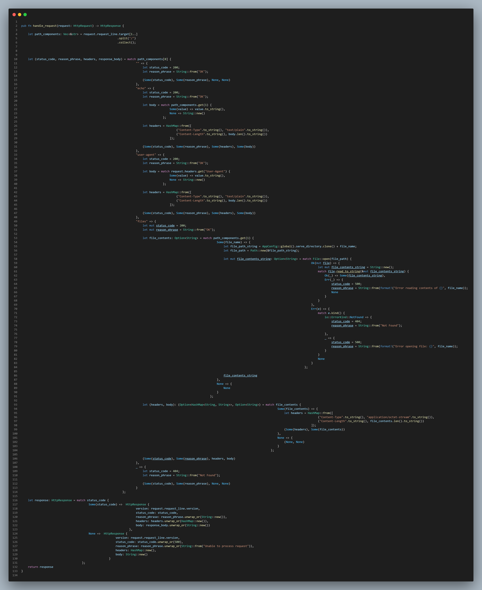

# I have a coding "style".. its bizarre
 

### I recently started experimenting with ways to my code files more readable. Ive found a interesting indent-scheme that adds alot more readablily for me. 
### Heres an example, see if you can spot the difference:  

| Normal People | Me |
| ----------- | ----------- |
|  |  |

 
 

### thats a tame example, here's a more apparent one

| Normal People | Me |
| ----------- | ----------- |
|  |  |

 
 

### its tied to variable declaration. Particularly, multi-line variable decalaration. 

### Multi-line variable declarations are very common but they tend to make code less readable for me. 

### I like to indent the lines a particular way to emphasize they are tied to the declaration of a variable
 

## Example 1
|   |   |
| ----------- | ----------- |
| take this variable for example |  |
| I would declare like this |  |

 

## Example 2

|   |   |
| ----------- | ----------- |
| this variable for example |  |
| I would declare like this |  |

 

## Example 3
|   |   |
| ----------- | ----------- |
| this variable for example |  |
| I would declare like this. (notice how i indented the request_line declaration. iss because its multi-line) |  |

 

### I find this indenting-scheme clarifies variable scopes and code-paths better

### When taken to the extreme this is what it leads to:

### I wish i could see some initial reactions to this example lol. The main thing i like is it clarifies this function declares only three variables in its upper-scope.

 

### I wouldnt dare contribute code like this to a big project. I know most people wouldnt appreciate it how "unique" it is haha. maybe ill develop a vscode extension that can toggle-display my code like this without formatting this file-contents itself

